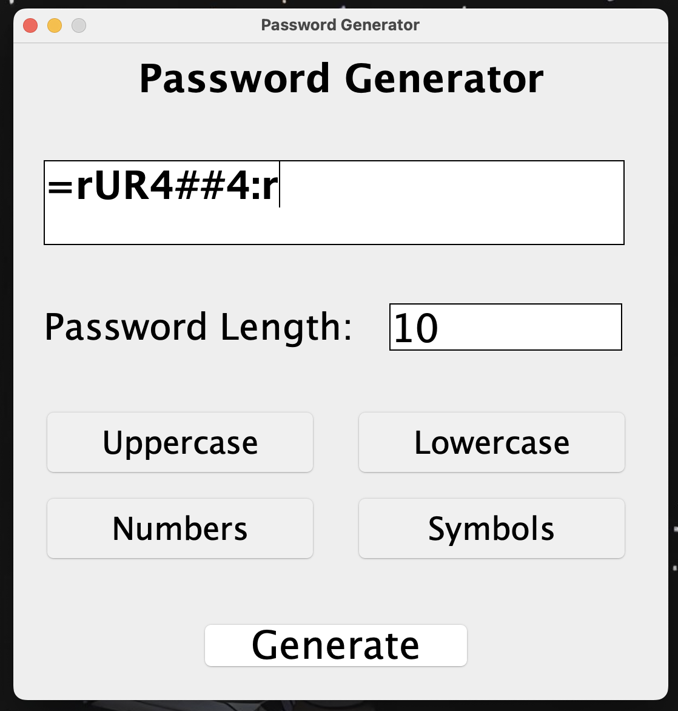
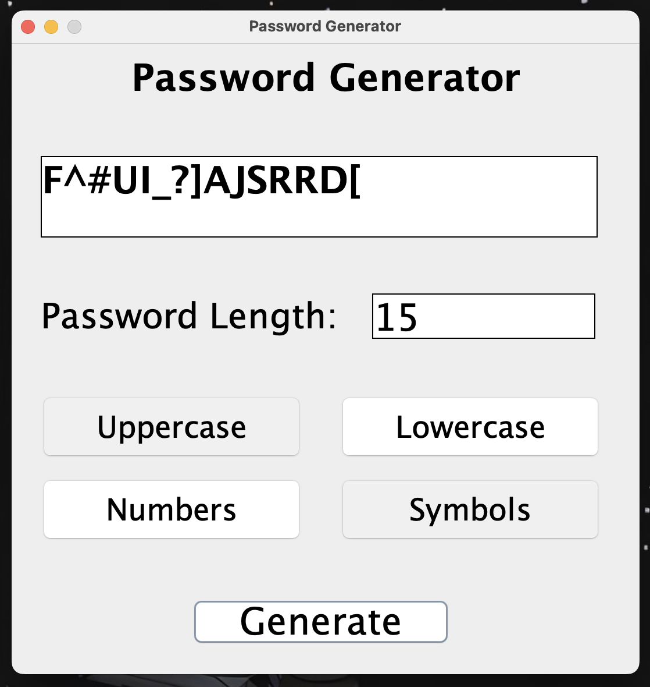
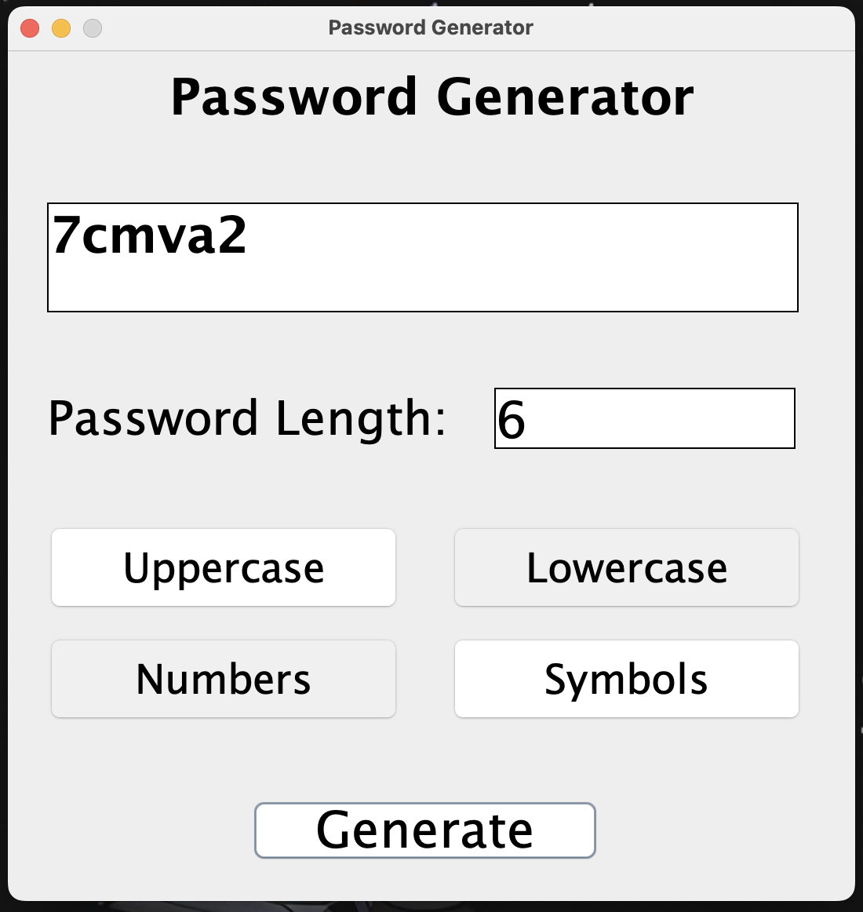
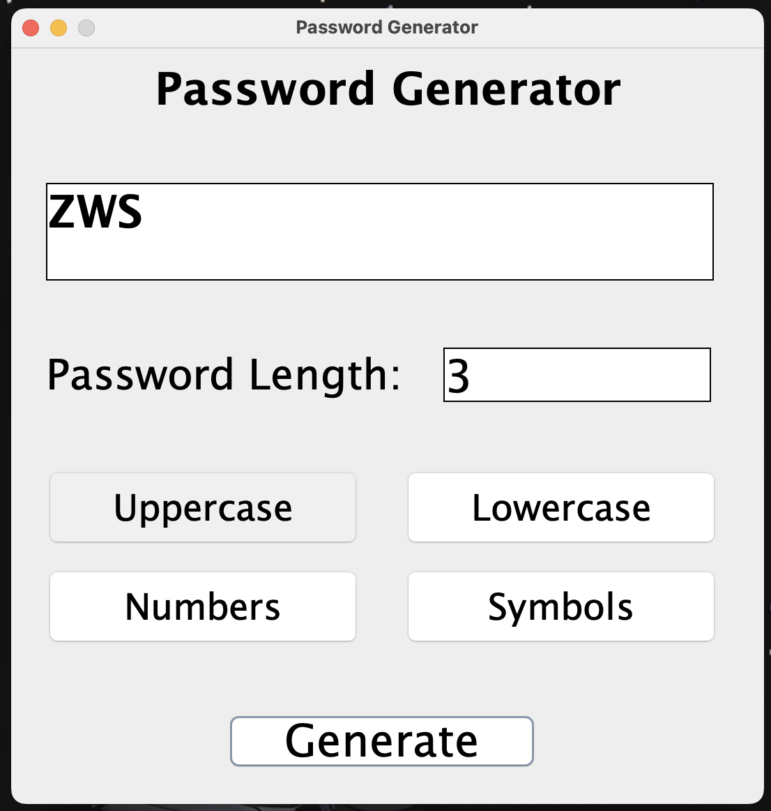

# Password Generator

A simple yet powerful password generator built using Java and Java Swing. This application allows you to generate strong, random passwords with customizable options for - length, inclusion/exclusion of special characters or symbols, numbers, uppercase and lowercase letters.

## Features

- **Customizable Password Length**: Set the desired password length.
- **Character Options**: Choose whether to include lowercase, uppercase, digits, and special characters.
- **Easy-to-Use GUI**: Simple and intuitive graphical user interface (GUI) built with Java Swing.

## Technology & Tools Used

- **Java**
- **Java Swing** 
- **IntelliJ IDEA (IDE)**

## Installation

1. Clone the repository:
    ```bash
    git clone https://github.com/AritraC1/PasswordGenerator.git
    ```
2. Open the project in your Java IDE.
3. Build and run the project.

## Demo



